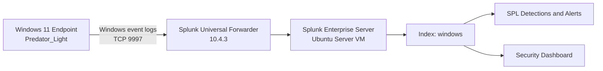
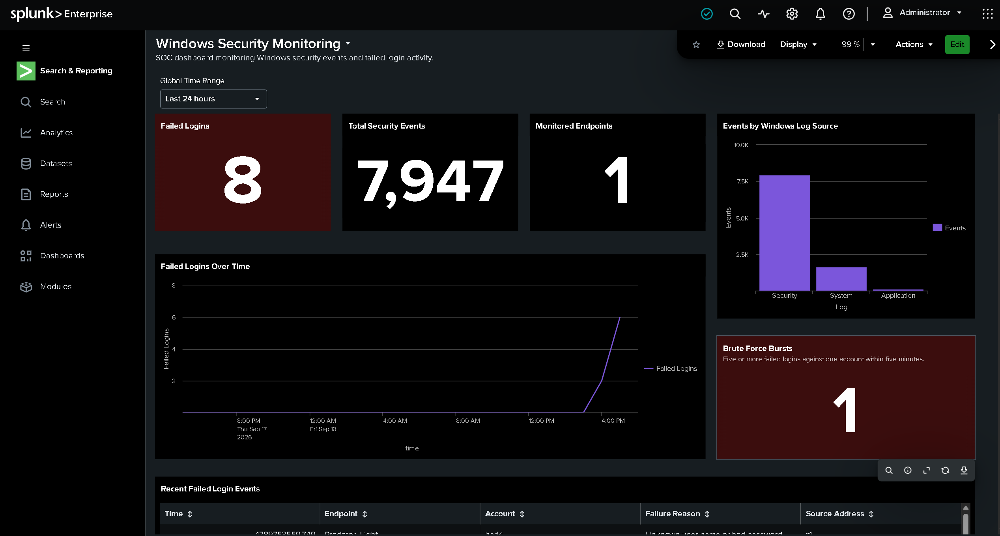
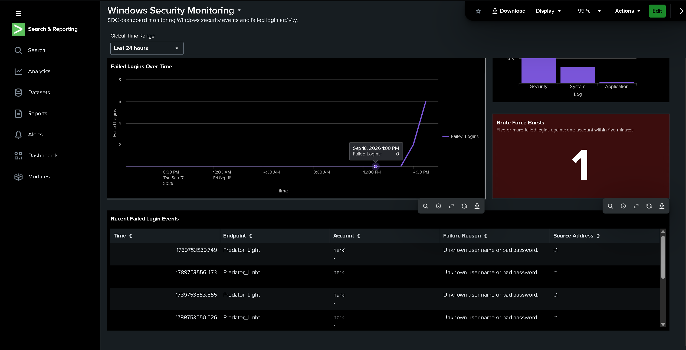

# Splunk SIEM Home Lab

A security monitoring home lab built with Splunk Enterprise to collect and analyze Windows event logs, detect failed login and brute-force activity, generate alerts, and visualize security events through a custom dashboard.

## Project Overview

This project simulates a small Security Information and Event Management (SIEM) environment. A Windows 11 endpoint forwards Application, Security, and System event logs to a Splunk Enterprise server hosted on an Ubuntu virtual machine. Custom SPL searches identify suspicious authentication activity and support scheduled security alerts.

The lab demonstrates practical experience with log ingestion, Windows security monitoring, SPL detection engineering, alert configuration, dashboard creation, and controlled detection testing.


## Lab Architecture



The Windows 11 endpoint runs the Splunk Universal Forwarder, which sends selected Windows event logs to Splunk Enterprise over TCP port `9997`. Splunk stores these events in the `windows` index for searching, detection, alerting, and visualization.


## Lab Environment

| Component | Configuration |
|---|---|
| Hypervisor | Oracle VirtualBox |
| SIEM Server | Ubuntu Server 24.04.5 LTS |
| SIEM Platform | Splunk Enterprise 10.4.3 |
| Monitored Endpoint | Windows 11 (`Predator_Light`) |
| Log Forwarder | Splunk Universal Forwarder 10.4.3 |
| Splunk Receiving Port | TCP `9997` |
| Splunk Index | `windows` |
| Network | VirtualBox NAT and host-only networking |

## Log Sources

The Splunk Universal Forwarder collects the following Windows Event Logs:

- `WinEventLog:Security` — authentication and security audit events
- `WinEventLog:System` — operating system and service events
- `WinEventLog:Application` — application-generated events

The Security log provides Windows Event ID `4625`, which represents a failed account logon and is used by the authentication detections in this project.


## Detection 1: Windows Failed Login

This detection identifies Windows failed-logon events using Security Event ID `4625`.

```spl
index=windows source="WinEventLog:Security" EventCode=4625
```

### Alert Configuration

- **Alert name:** Windows Failed Login Detected
- **Schedule:** Every 15 minutes
- **Search window:** Last 15 minutes
- **Trigger condition:** Number of results is greater than `0`
- **Severity:** Medium
- **Action:** Add to Triggered Alerts

  ## Detection 2: Windows Brute-Force Attempt

This detection groups failed logins by account, endpoint, and source address within five-minute windows. Five or more failures are treated as a possible brute-force attempt.

```spl
index=windows source="WinEventLog:Security" EventCode=4625
| eval Account=mvindex(Account_Name,0)
| bin _time span=5m
| stats count as Failed_Attempts by _time host Account Source_Network_Address
| where Failed_Attempts >= 5
| sort - Failed_Attempts
```

### Alert Configuration

- **Alert name:** Windows Brute Force Attempt Detected
- **Schedule:** Every 5 minutes
- **Search window:** Last 15 minutes
- **Trigger condition:** Number of results is greater than `0`
- **Trigger mode:** Once
- **Throttle period:** 15 minutes
- **Severity:** High
- **Action:** Add to Triggered Alerts

## Controlled Detection Testing

Failed-logon events were generated in a controlled lab environment with the Windows `runas` command:

```powershell
runas /user:$env:COMPUTERNAME\$env:USERNAME cmd.exe
```

Incorrect test credentials were entered manually to generate Event ID `4625`. No passwords, credentials, or authentication secrets are stored in this repository.

The brute-force test produced six failed logins against the same account within five minutes. Splunk successfully grouped the events into one matching brute-force burst and triggered the scheduled alert.

## Security Dashboard

The `Windows Security Monitoring` dashboard was created in Splunk Dashboard Studio using a dark theme and a global 24-hour time range.

Dashboard panels include:

1. Failed Logins
2. Total Security Events
3. Monitored Endpoints
4. Failed Logins Over Time
5. Events by Windows Log Source
6. Recent Failed Login Events
7. Brute Force Bursts

The Brute Force Bursts panel uses this SPL:

```spl
index=windows source="WinEventLog:Security" EventCode=4625
| eval Account=mvindex(Account_Name,0)
| bin _time span=5m
| stats count as Failed_Attempts by _time host Account Source_Network_Address
| where Failed_Attempts >= 5
| stats count as "Brute Force Bursts"
```

## Dashboard Screenshots

### Dashboard Overview



### Failed-Login Events and Brute-Force Detection



## Results

The completed lab successfully:

- Collected thousands of Windows Application, Security, and System events
- Centralized endpoint logs in the Splunk `windows` index
- Detected Windows failed-logon Event ID `4625`
- Identified six failed logins within a five-minute window
- Triggered medium-severity and high-severity scheduled alerts
- Displayed authentication activity through a custom SIEM dashboard

## Skills Demonstrated

- Splunk Enterprise administration
- Splunk Universal Forwarder configuration
- Windows Event Log analysis
- Search Processing Language (SPL)
- Detection engineering
- Alert creation and tuning
- SIEM dashboard development
- Controlled security testing
- VirtualBox networking
- Ubuntu Server administration

## Security and Privacy

This repository contains documentation, defensive SPL searches, and sanitized screenshots from an isolated home-lab environment. It does not contain passwords, API keys, session tokens, private keys, or Splunk configuration files containing credentials.

## Future Improvements

- Add detections for successful logins following repeated failures
- Monitor account lockouts using Windows Event ID `4740`
- Add process-creation monitoring using Event ID `4688`
- Map detections to the MITRE ATT&CK framework
- Expand the lab with Sysmon telemetry and additional endpoints
